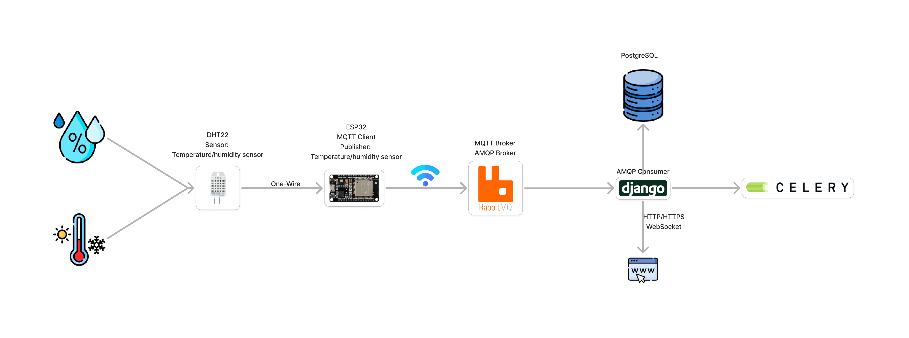

# SensorHub
O SensorHub é um software desenvolvido com o objetivo de agregar sensores e explorar novas técnicas de desenvolvimento. Utilizando o Django, criamos um ambiente web para o gerenciamento de sensores e ambientes. Ao cadastrar sensores no banco de dados, eles são automaticamente registrados como Publishers no Broker MQTT.

Para os testes, utilizamos o sensor DHT22, que captura as medições de temperatura e umidade e envia os dados para o ESP32 via protocolo One-Wire. Esses dados são convertidos para o protocolo MQTT e publicados na rede. O servidor RabbitMQ recebe as informações, as converte para o protocolo AMQP e permite que o Django as consuma. Os dados recebidos são enviados via WebSockets para monitoramento em tempo real e armazenados no banco de dados PostgreSQL, permitindo consulta de histórico.

<h1 align="center">
     
    
     
</h1>